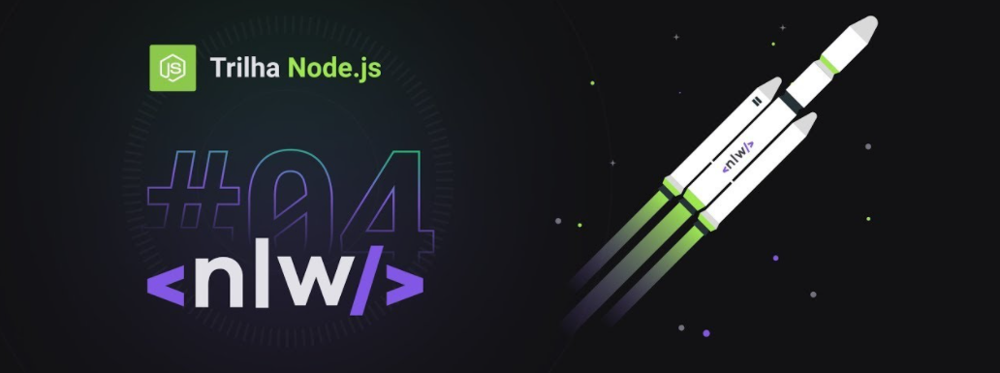

<h1 align="center">NPS API 💻</h1>

<p align="center">
    Projeto desenvolvido durante a 4º Edição do Evento Next Level Week (Trilha Node.js), da Rocketseat, com a Instrutora <a href="https://github.com/danileao">Daniele Leão</a>. 🚀
</p>

<p align="center">
    
    
</p>

<p align="center">
    
</p>

<p align="center">
    <a href="#-o-projeto">O Projeto</a> •
    <a href="#-tecnologias">Tecnologias</a> •
    <a href="#-como-usar">Como Usar</a> •
    <a href="#-licença">Licença</a>
</p>

<h2>🚀 O Projeto</h2>

<p>O projeto NPS API tem o objetivo de calcular o NPS de uma empresa.</p>
<p>O NPS (Net Promoter Score) é uma métrica muito importante para as empresas, pois indica o nível de satisfação dos clientes.</p>
<p>Nessa API, Temos as funcionalidades de cadastrar usuários, cadastrar pesquisas, ver as pesquisas cadastradas, enviar email para os usuários para responder as pesquisas, receber as respostas dos usuários e calcular o NPS.</p>

<h2>🔨 Tecnologias</h2>

<p>O projeto foi desenvolvido utilizando as seguintes tecnologias:</p>

- [Node.js](https://nodejs.org/en/)
- [Typescript](https://www.typescriptlang.org/)
- [Express](https://expressjs.com/pt-br/)
- [Ethereal-Email](https://ethereal.email/)
- [SQLite3](https://www.sqlite.org/index.html)
- [TypeORM](https://typeorm.io/#/)
- [Jest](https://jestjs.io/)
- [Supertest](https://www.npmjs.com/package/supertest)
- [Handlebars](https://handlebarsjs.com/)
- [UUID](https://www.npmjs.com/package/uuid)
- [Yup](https://github.com/jquense/yup)
- [DBeaver](https://dbeaver.io/)

<h2>🔧 Como Usar</h2>

<h3>Pré-Requisitos</h3>

<p>Antes de começar, você vai precisar ter instalado em sua máquina as seguintes ferramentas:</p>

- [GIT](https://git-scm.com)
- [Node.js](https://nodejs.org/en/)
- [VSCode](https://code.visualstudio.com/)

<p>Caso não queira o npm como o seu gerenciador de pacotes, pode utilizar também o:</p>

- [Yarn](https://yarnpkg.com/)

<h3>Rodando o Servidor</h3>

```bash
# Clone este repositório
$ git clone https://github.com/guilhermegregory/rocketseat-nlw04-nodejs

# Acesse a pasta do projeto pelo terminal
$ cd rocketseat-nlw04-nodejs

# Instale as dependências com yarn
$ yarn add

# Ou, se preferir, instale as dependências com npm
$ npm install

# Rode as migrations com yarn
$ yarn typeorm migration:run

# Ou, se preferir, rode as migrations com npx
$ npx typeorm migration:run

# Inicie o servidor com yarn
$ yarn dev

# Ou, se preferir, inicie o servidor com npm
$ npm run dev

# O servidor iniciará na porta 3333 - acesse http://localhost:3333/
```

<h3>Rodando os Testes</h3>

```bash
# Na pasta do projeto, rode o teste com yarn
$ yarn test

# Ou, se preferir, rode o teste com npm
$ npm run test
```

<h2>📄 Licença</h2>

<p>
    Este projeto está sob a licença MIT. Para mais detalhes, veja o arquivo <a href="license.md">LICENSE</a>.
</p>

---

<h4 align="center">
    Feito com 💙 by <a href="">Guilherme Gregory</a>.
</h4>